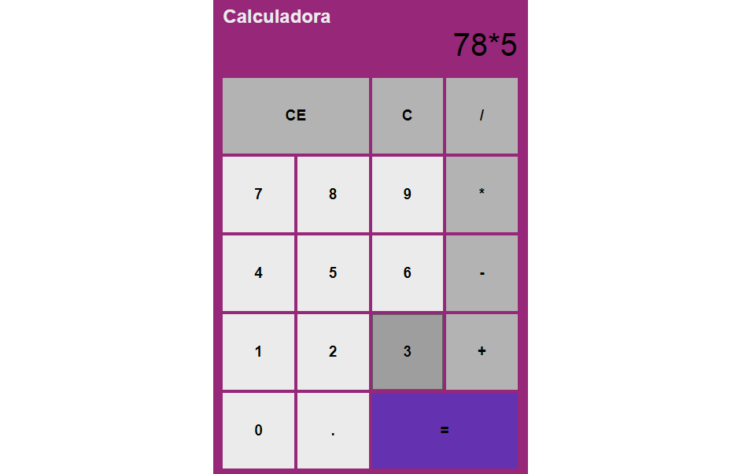
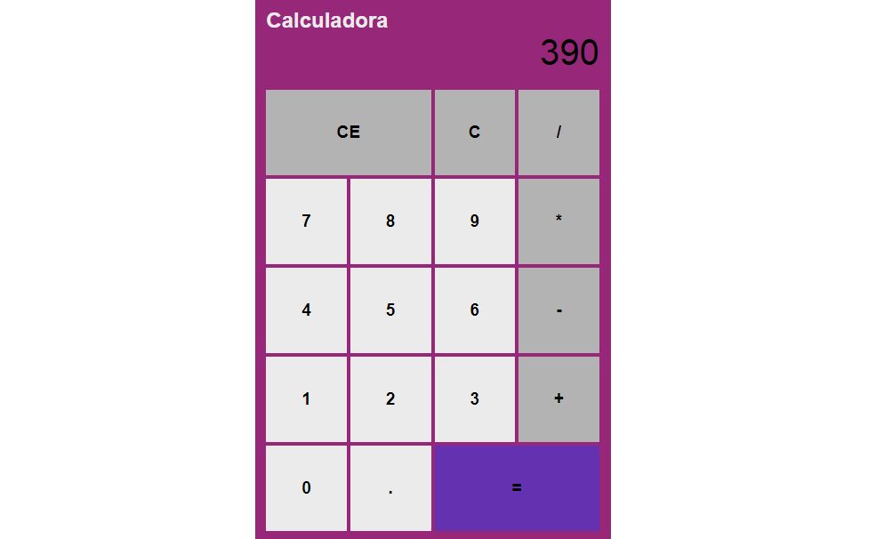
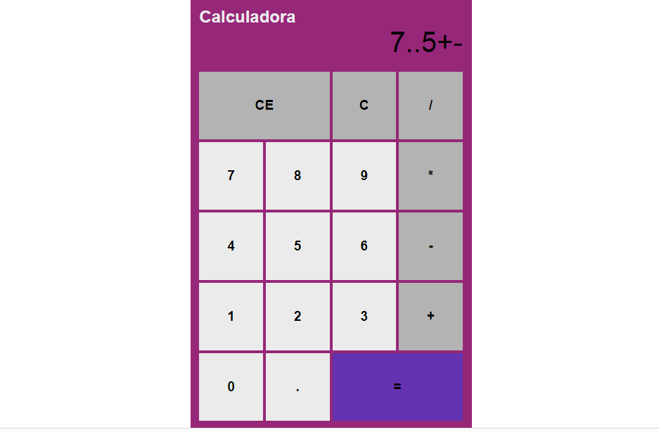

## Calculadora Simples

## O projeto

O desafio desse projeto era fazer uma calculadora que fizesse as quatro operações matemáticas ( divisão /, multiplicação X, subtração - e soma +). Ainda falta fazer a função de poder colocar somente um ponto(.) enão deixar que alguns sinais sejam colocados em lugares errados por exemplo (X/ multiplicação e divisão sucessivos) e outros exemplos   como no mostrado abaixo: 

Mas para fazer contas básicas ela já está funcionando, tem também o botão de apagar (CE), e o botão que apaga do último número até não restar mais números (C).

## Linguagens Utilizadas

## Contato

- [Linkedin](https://www.linkedin.com/in/crisleine-erculano/)

## Conclusão

Todos nós sabemos como funciona uma calculadora, mas na hora de passar isso pra código não é tão simples como parece, ainda mais pra quem é iniciante no mundo da programação, tenho muito que aprender, e aprender e aprender, mas com constância chegarei mais perto do que almeijo. Fico feliz em poder compartilhar o que vou aprendendo ao longo dessa imensa jornada, e com certeza o dia de amanhã será no mínimo 1% melhor do que o de hoje.

